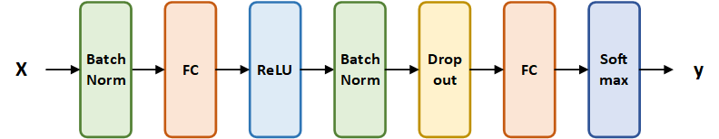
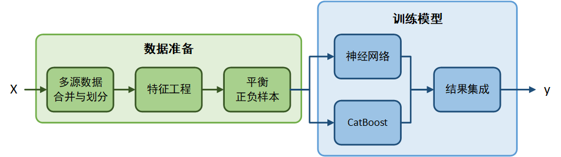
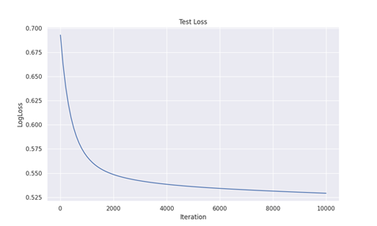
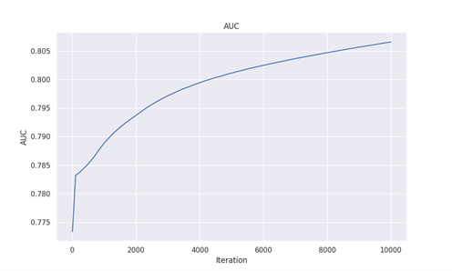
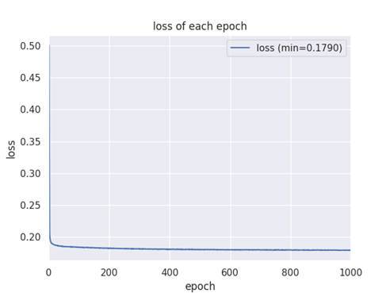
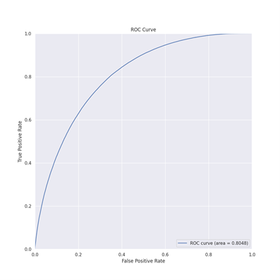

# 个贷违约预测 Default Prediction

## 简介 Introduction

本项目为[CCF大数据与计算智能大赛-个贷违约预测](https://www.datafountain.cn/competitions/530/)赛题的项目代码。

赛题要求利用已有的与目标客群稍有差异的另一批信贷数据，辅助目标业务风控模型的创建，两者数据集之间存在大量相同的字段和极少的共同用户。此处希望大家可以利用迁移学习捕捉不同业务中用户基本信息与违约行为之间的关联，帮助实现对新业务的用户违约预测。

针对贷款违约预测的任务，我们使用个人贷款违约记录数据和某网络信用贷产品违约记录数据作为数据来源，对原始数据进行了数据的合并与划分、数据清洗、样本平衡采样等一系列的预处理后，使用神经网络模型和CatBoost模型分别拟合，最后对两个模型的预测结果进行集成，得到最终的预测结果。我们分析了实验结果，并进行了大量的对比实验，确定了选择的模型及其超参数。

## 运行方法 Running Method

本实验代码使用纯python语言，其中神经网络部分基于pytorch深度学习框架。代码在linux和windows系统环境中均可运行。建议使用带有CUDA显卡的设备上运行，效率会更高。

运行代码的方式非常简单。打开终端，输入下面的命令即可运行默认程序。

```shell
pip install -r requirements.txt
```

```shell
python main.py
```

如果需要修改参数，可以直接在终端运行下面的命令查看可选的超参数列表，并可以在命令行里直接更改超参数的取值。

```shell
python main.py -h
```

本项目除了数据部分的源代码已经更新到GitHub上，因此实际上只需在终端运行下面的命令，即可获取本项目的代码。

```shell
git clone https://github.com/FlyingPolarBear/default-prediction.git
```

数据部分可在大赛官网获取。

## 技术方案 Methods

### 数据准备

#### 多源数据合并与划分

如上一章所述，给定的数据有不同来源的训练数据集$D_{tr}^{pub}$、$D_{tr}^{net}$，以及测试数据集$D_{te}$。在加载数据后，首先需要对该数据进行清洗。

#### 特征工程

对于这种传统机器学习任务，特征工程是决定算法上限的关键，具有极其重要的作用。同时，为了使得大多数算法可以理解并处理数据集，还需要进行离散特征的连续化和缺失值补全。

#### 平衡正负样本

通过分析数据我们发现，处理后的训练集包含760000个样本，其中正例有151356个，负例有608644个，正负例数量比约为1:4。而验证发现，测试集样本的正负数量比为1:1。因此，本任务存在着明显的正负样本数量不平衡的问题。

解决正负样本数量不平衡的问题的方法有很多，其中最简单也最有效的方法是采样。采样直接改变了数据集的正负样本数量比例，而没有影响样本的分布，主要分为对多数样本的下采样和对少数样本的上采样。我们分别尝试了下采样和上采样这两种方法，发现在大多数情况下，这两种方法都能够大幅提升模型效果，但是两种方法之间的差距不大。下采样方法由于减少了数据量，因此后面模型拟合时效率更高。上采样方法没有数据量的损失，对于神经网络这种对数据量敏感的方法比较适用。因此，对于CatBoost模型，我们选取了下采样的方法；对于神经网络模型，我们选取了上采样的方法。

### 训练模型

#### CartBoost模型

对于较为少量的数据，基于树的集成学习模型往往是非常有效的。我们对比了XGBoost、LightGBM、随机森林、GBDT和CatBoost五种常用的基于树的集成学习模型，最终选取了CatBoost模型。CatBoost是俄罗斯的搜索巨头Yandex在2017年开源的机器学习库，是Boosting族算法的一种。CatBoost是一种基于对称决策树为基学习器实现的参数较少、支持类别型变量和高准确性的GBDT框架，主要解决的痛点是高效合理地处理类别型特征，这一点从它的名字中可以看出来，CatBoost是由Categorical和Boosting组成。此外，CatBoost还解决了梯度偏差以及预测偏移的问题，从而减少过拟合的发生，进而提高算法的准确性和泛化能力。

由于训练集标签是二值化的，因此我们首先训练分类器，而在预测时输出连续的概率值。

#### 神经网络模型

近年来，神经网络模型以其自动提取特征的特点、高并行化的运行设计而被广泛使用在预测任务中。我们设计了一个简单的多层神经网络模型来进行预测。神经网络的结构图如下：



其中，BatchNorm表示批规范化，用以保证训练数据的分布是稳定的；FC是全连接神经网络；ReLU是非线性激活函数；Dropout是一种正则化方法，通过在训练过程中会随机使一部分的神经元失活来增强模型的泛化性能。Softmax是输出概率的函数。使用均方误差作为损失函数。

#### 预测结果的集成

理论和实践表明，基于树的集成学习模型的学习过程类似，将它们进行结果集成意义不大，而对基于树的集成学习模型和基于神经网络的模型进行结果集成可以发挥两种模型各自的优势。因此，我们将分别将数据放入CatBoost和神经网络中进行训练，得到了两个预测结果$\hat{y}_{te}^{catb}$和$\hat{y}_{te}^{NN}$  。根据集成学习的思想，我们对这两个结果进行结果集成，即

$$\hat{y}_{te}=\alpha\hat{y}_{te}^{catb}+(1-\alpha)\hat{y}_{te}^{NN}$$

我们分别实验了单独使用CatBoost模型和神经网络模型的效果，发现Catboost的效果略好，因此设定超参数$\alpha=0.6$。

最终实验处理部分的流程图如下：



## 实验结果与分析 Experiment and Analysis

### 实验参数设定

实验在一台Linux系统服务器上运行，python版本为3.8.0。计算机CPU型号为11th Gen Intel(R) Core(TM) i5-11500 @ 2.70GHz，显卡型号为Nvidia GeForce RTX 3090。实际上，这样的计算资源不是必须的，但是运算效率较高的显卡可以加速训练过程。

对于神经网络模型，我们设置训练的epoch数为1000；batch的大小为20000；学习率为0.0001；学习权重衰减为1e5；模型隐藏层维度为256，dropout的概率为0.5。

对于CatBoost模型，我们设置迭代的次数为100000；学习率大小为0.001；树的最大深度为8。

#### 实验结果与分析

根据大赛官方网站的评测，我们的方法在A榜中的AUC为**0.86468736**；在B榜中的AUC为**0.87051387**。方法取得的性能显著高于大赛的基线水平。

##### CatBoost损失衰减情况



##### CatBoost AUC收敛情况



##### NN损失的衰减情况



##### NN模型最终的ROC曲线



### 参数调节

#### 集成学习模型选择

我们对比了XGBoost[1]、LightGBM[2]、随机森林[3]、GBDT[4]和CatBoost[5]五种常用的基于树的集成学习模型，实验结果如下：

|   **模型**    | XGBoost | LightGBM | 随机森林 |  GBDT  | **CatBoost** |
| :-----------: | :-----: | :------: | :------: | :----: | :----------: |
| **开发集AUC** | 0.7978  |  0.8012  |  0.7858  | 0.6930 |  **0.8176**  |

显然，CatBoost模型要好于其他的集成学习模型。

#### 神经网络参数调节

我们对神经网络的层数进行了调节，训练epoch数设为200，实验结果如下：

| **层数**      | **2**      | 3      | 4      |
| ------------- | ---------- | ------ | ------ |
| **开发集AUC** | **0.7977** | 0.7908 | 0.7850 |

可以看到，随着层数增加，训练的效率降低，但训练效果却没有变好，这可能由于梯度消失和梯度爆炸导致的。因此，我们只使用单隐层的神经网络模型。

对于迭代次数，一般是越多越好，但是到了后面精度增长速率会越来越慢。因此折中选择了1000个epoch。

对于batch大小，由于实验设备较好，显存大小达到了24G，因此可以batch大小可以设定得很大，这里设定为20000。

